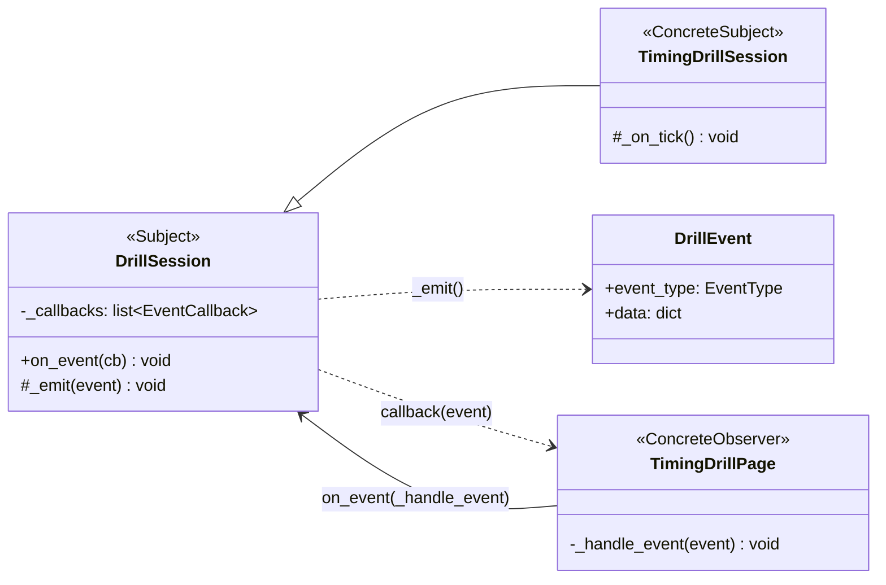
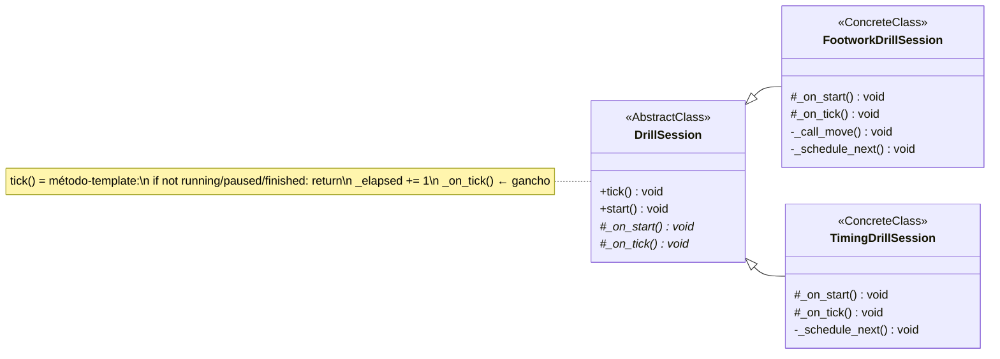
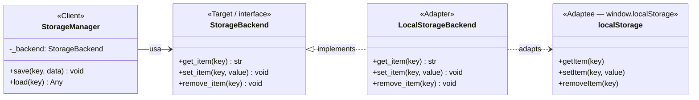

# Diagrama de Classes com Padrões de Projeto — Entrega 3

Para renderizar:

- **GitHub:** abre nativamente este arquivo já renderizado.
- **VS Code:** instale "Markdown Preview Mermaid Support" e abra o preview.
- **Online:** copie cada bloco para <https://mermaid.live>.

## Padrões Escolhidos

| Membro | Padrão GoF (categoria)        | Onde aparece no código                                                                 |
| ------ | ----------------------------- | -------------------------------------------------------------------------------------- |
| Pedro  | **Observer** (comportamental) | `DrillSession` (Subject) emite `DrillEvent` para `TimingDrillPage` (Observer)          |
| Vitor  | **Template Method** (comp.)   | `DrillSession.tick()`/`start()` definem o esqueleto; `FootworkDrillSession` preenche os ganchos |
| Ruy    | **Adapter** (estrutural)      | `LocalStorageBackend` adapta o `window.localStorage` do navegador ao `StorageBackend`  |

> Observação: `DrillSession` hospeda **dois** padrões simultaneamente — Observer (Pedro) no mecanismo de eventos e Template Method (Vitor) no ciclo de `tick`. Isso é intencional e está marcado nas notas do diagrama.

---

## Diagrama de Classes Geral

```mermaid
classDiagram
    direction TB

    %% ===================== OBSERVER (Pedro) =====================
    class DrillSession {
        <<abstract>>
        #_config: DrillConfig
        #_elapsed: int
        #_is_running: bool
        #_is_paused: bool
        #_is_finished: bool
        #_callbacks: list~EventCallback~
        +on_event(callback) void
        +start() void
        +pause() void
        +resume() void
        +stop() void
        +tick() void
        #_emit(event) void
        #_on_start()* void
        #_on_tick()* void
    }

    class DrillEvent {
        <<frozen dataclass>>
        +event_type: EventType
        +data: dict
    }

    class EventType {
        <<enum>>
        STIMULUS
        MOVE_CALL
        SESSION_END
        ROUND_START
        ROUND_END
        ...
    }

    class TimingDrillSession {
        -_cfg: TimingDrillConfig
        -_rng: Random
        -_next_stimulus_at: int
        -_schedule_next() void
        #_on_start() void
        #_on_tick() void
    }

    class FootworkDrillSession {
        -_cfg: FootworkDrillConfig
        -_rng: Random
        -_next_call_at: int
        -_schedule_next() void
        -_call_move() void
        #_on_start() void
        #_on_tick() void
    }

    class TimingDrillPage {
        +render() str
        +mount() void
        -_on_start() void
        -_on_pause() void
        -_on_stop() void
        -_handle_event(event) void
    }

    class FootworkDrillPage {
        +render() str
        +mount() void
        -_on_start() void
        -_handle_event(event) void
    }

    class DrillTimer {
        -_session: DrillSession
        -_audio: AudioEngine
        +start() void
        +pause() void
        +resume() void
        +stop() void
    }

    %% ===================== CONFIG =====================
    class DrillConfig {
        <<abstract>>
        +validate()* void
        +to_dict()* dict
    }
    class TimingDrillConfig {
        +total_duration: int
        +min_interval: int
        +max_interval: int
        +target_technique: str
        +validate() void
    }
    class FootworkDrillConfig {
        +moves: list~FootworkMove~
        +min_interval: int
        +max_interval: int
        +total_duration: int
        +validate() void
    }

    %% ===================== ADAPTER (Ruy) =====================
    class StorageBackend {
        <<interface>>
        +get_item(key) str
        +set_item(key, value) void
        +remove_item(key) void
    }
    class LocalStorageBackend {
        +get_item(key) str
        +set_item(key, value) void
        +remove_item(key) void
    }
    class StorageManager {
        -_backend: StorageBackend
        +save(key, data) void
        +load(key) Any
        +clear(key) void
    }
    class AppState {
        -_storage: StorageManager
        +combo_library: ComboLibrary
        +footwork_library: FootworkMoveLibrary
        +save() void
        +load() bool
        +to_dict() dict
    }
    class ComboLibrary {
        -_combos: list~Combo~
        +add(combo) void
        +remove(name) void
        +get_by_name(name) Combo
        +list_all() list~Combo~
    }
    class Combo {
        <<dataclass>>
        +name: str
        +sequence: str
        +__post_init__() void
    }
    class ComboLibraryPage {
        +render() str
        +mount() void
        -_on_add() void
        -_on_delete(name) void
        -_rerender() void
    }
    class localStorage {
        <<JS / window.localStorage>>
        +getItem(key)
        +setItem(key, value)
        +removeItem(key)
    }

    %% ===================== RELAÇÕES =====================
    %% Template Method + herança das sessões (Vitor)
    DrillSession <|-- TimingDrillSession
    DrillSession <|-- FootworkDrillSession
    DrillConfig <|-- TimingDrillConfig
    DrillConfig <|-- FootworkDrillConfig
    DrillSession --> DrillConfig : _config
    TimingDrillSession ..> TimingDrillConfig
    FootworkDrillSession ..> FootworkDrillConfig

    %% Observer (Pedro)
    DrillSession ..> DrillEvent : _emit()
    DrillEvent --> EventType
    TimingDrillSession ..> DrillEvent : produz STIMULUS
    FootworkDrillSession ..> DrillEvent : produz MOVE_CALL
    TimingDrillPage --> DrillSession : on_event(_handle_event)
    FootworkDrillPage --> DrillSession : on_event(_handle_event)
    DrillTimer --> DrillSession : tick()
    TimingDrillPage --> DrillTimer
    FootworkDrillPage --> DrillTimer

    %% Adapter (Ruy)
    StorageBackend <|.. LocalStorageBackend : implements
    LocalStorageBackend ..> localStorage : adapts (adaptee)
    StorageManager --> StorageBackend : _backend
    AppState --> StorageManager : _storage
    AppState --> ComboLibrary
    ComboLibrary o-- Combo
    ComboLibraryPage --> AppState

    note for DrillSession "OBSERVER (Pedro): Subject.\non_event() registra observers;\n_emit() notifica todos os _callbacks.\n\nTEMPLATE METHOD (Vitor): tick()/start()\nsão os métodos-template; _on_start()\ne _on_tick() são os ganchos abstratos."
    note for FootworkDrillSession "TEMPLATE METHOD (Vitor):\nConcreteClass — implementa\n_on_start() e _on_tick()."
    note for TimingDrillPage "OBSERVER (Pedro):\nConcreteObserver — _handle_event\nreage a STIMULUS / SESSION_END."
    note for StorageBackend "ADAPTER (Ruy): Target.\nInterface esperada pelo cliente\n(StorageManager)."
    note for LocalStorageBackend "ADAPTER (Ruy): Adapter.\nConverte a API JS window.localStorage\nna interface StorageBackend."
    note for localStorage "ADAPTER (Ruy): Adaptee.\nAPI nativa do navegador."
```

---

## Recortes por Padrão

### Pedro — Observer (comportamental)

`DrillSession` é o **Subject**: mantém `_callbacks`, registra observadores via `on_event()` e os notifica em `_emit()`. As páginas (`TimingDrillPage._handle_event`) são **ConcreteObservers** que reagem aos `DrillEvent` emitidos, desacoplando a máquina de estados da camada de UI/áudio.

### Vitor — Template Method (comportamental)

`DrillSession.tick()` e `start()` definem o **esqueleto invariante** do algoritmo (guardas de estado, incremento de `_elapsed`, chamada dos ganchos). As subclasses preenchem apenas os passos variáveis `_on_start()` e `_on_tick()` — `FootworkDrillSession` sorteia e anuncia movimentações; `TimingDrillSession` agenda estímulos.

### Ruy — Adapter (estrutural)

`StorageBackend` (Protocol) é o **Target** que o `StorageManager` consome. `LocalStorageBackend` é o **Adapter** que converte a API nativa do navegador `window.localStorage` (**Adaptee**, acessada via interop JS do PyScript) para essa interface. Em testes, um fake baseado em `dict` substitui o adapter sem alterar o cliente.

