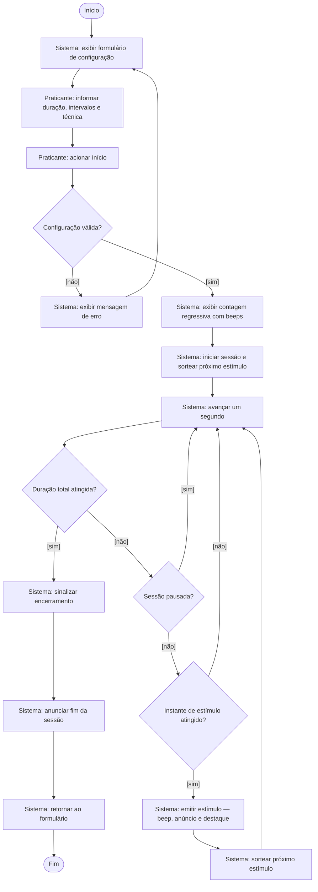
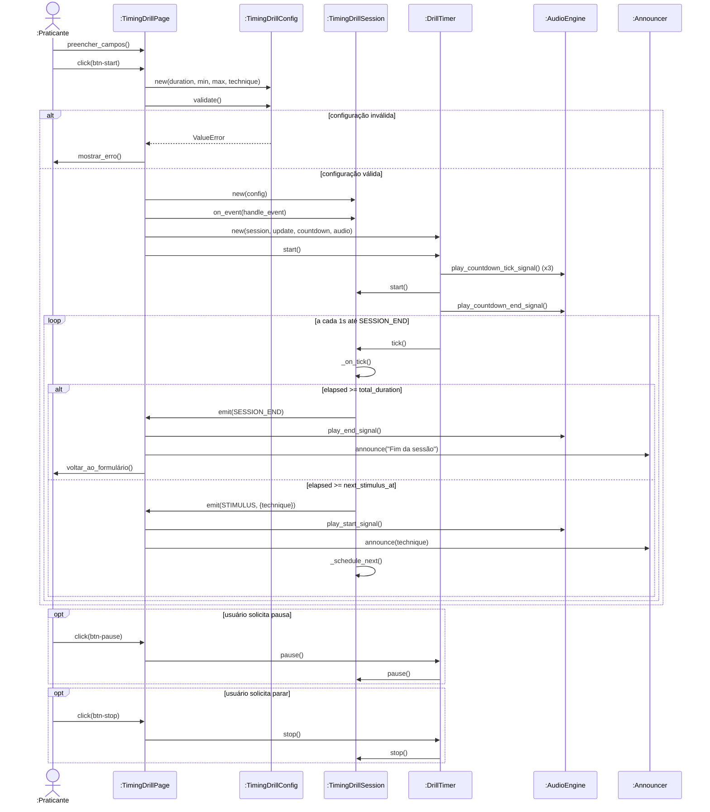
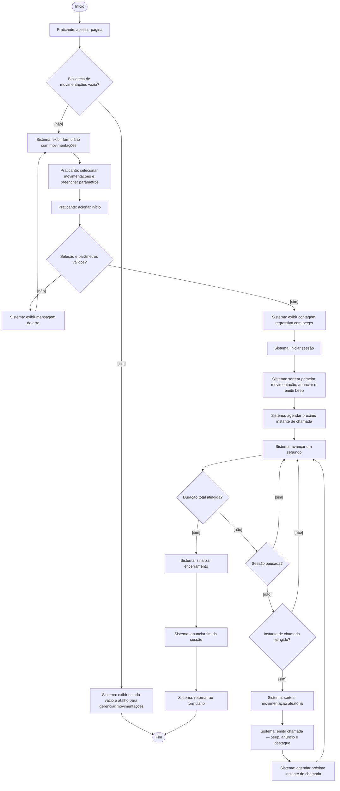
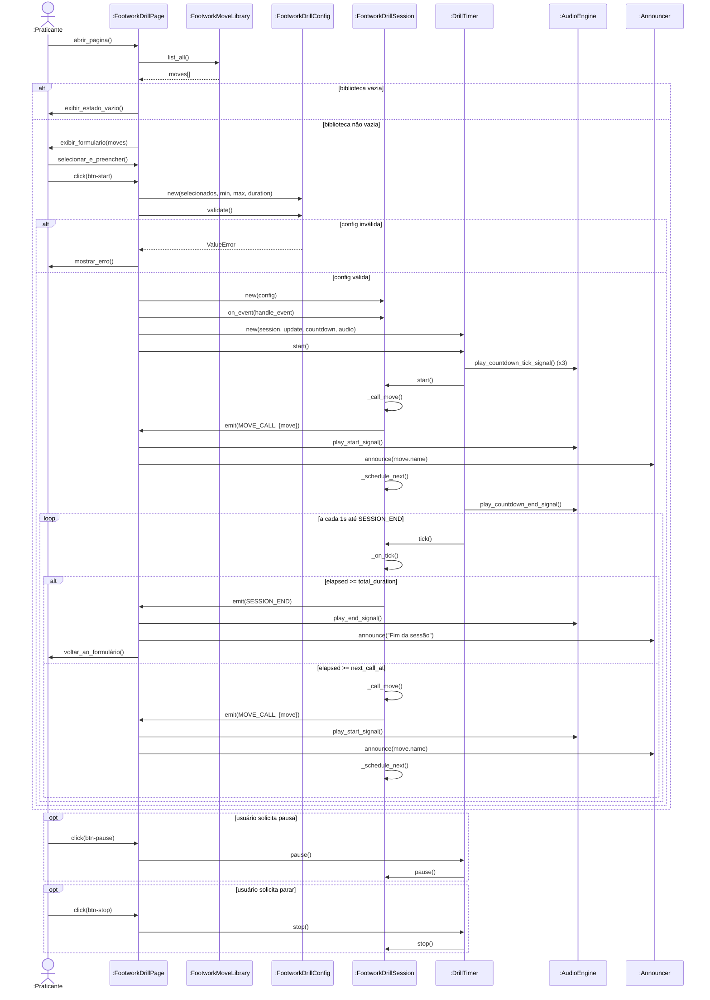
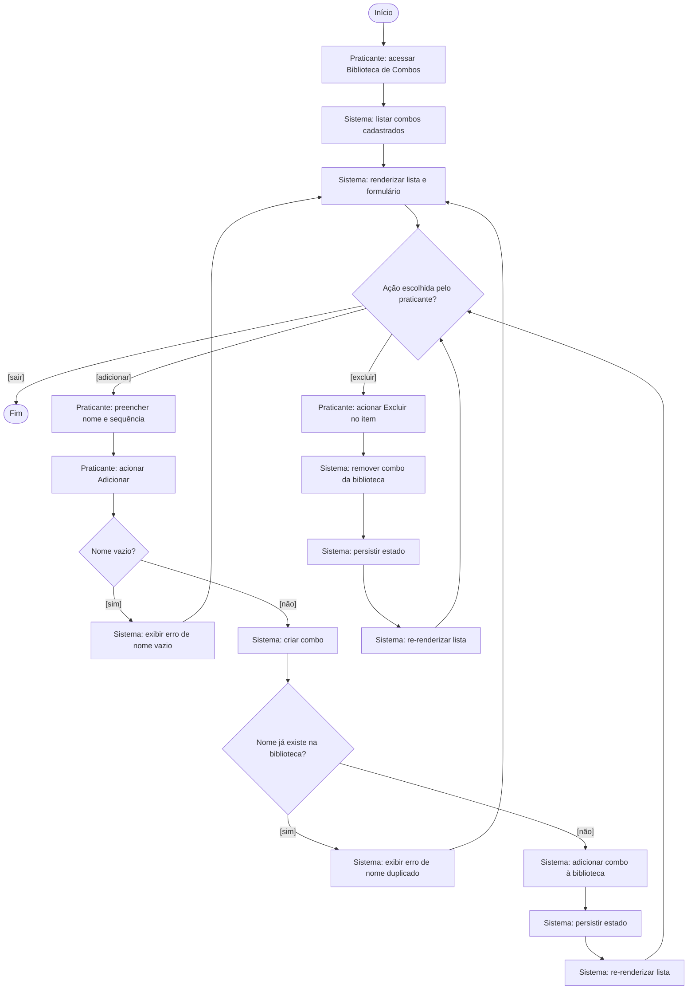
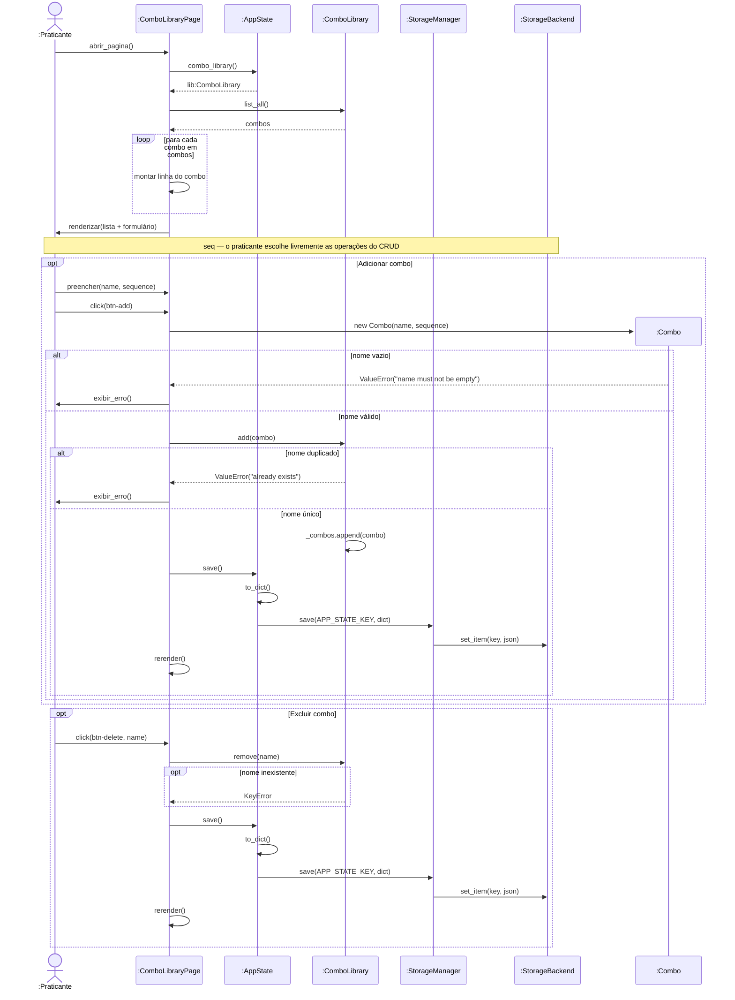

# Diagramas — Entrega 3

Diagramas em Mermaid para visualização e captura de tela. Para renderizar:

- **GitHub:** abre nativamente este arquivo já renderizado.
- **VS Code:** instale "Markdown Preview Mermaid Support" e abra o preview.
- **Online:** copie cada bloco para <https://mermaid.live>.

---

## UC02 — Executar Timing Drill (Pedro)

### Diagrama de Atividades — UC02

### Diagrama de Sequência — UC02

---

## UC04 — Executar Footwork Drill (Vitor)

### Diagrama de Atividades — UC04

### Diagrama de Sequência — UC04

---

## UC05 — Gerenciar Combos (Ruy)

### Diagrama de Atividades — UC05

### Diagrama de Sequência — UC05

